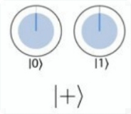
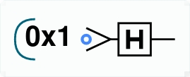
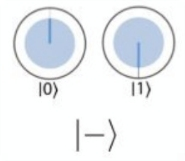
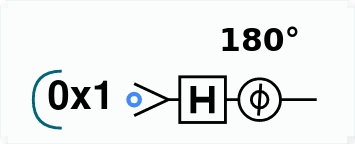
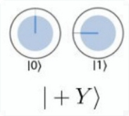
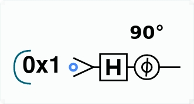
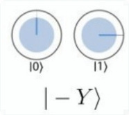
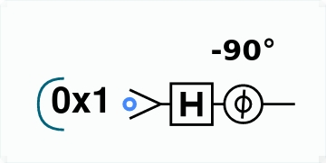

# Task 1

## State 1

We want to achieve the superposition $|+\rangle$, depicted in its circle notation in the following figure.

{width=100px}

A circuit that does that is the following:

{width=100px}

In order to get this circuit, I used the following code:

```js
qc.reset(1);
qc.write(0);
qc.had();
```

## State 2

We want to achieve the superposition $|-\rangle$, depicted in its circle notation in the following figure.

{width=100px}

A circuit that does that is the following:

{width=100px}

In order to get this circuit, I used the following code:

```js
qc.reset(1);
qc.write(0);
qc.had();
qc.phase(180);
```

## State 3

We want to achieve the superposition $|+Y\rangle$, depicted in its circle notation in the following figure.

{width=100px}

A circuit that does that is the following:

{width=100px}

In order to get this circuit, I used the following code:

```js
qc.reset(1);
qc.write(0);
qc.had();
qc.phase(90);
```

\newpage

## State 4

We want to achieve the superposition $|-Y\rangle$, depicted in its circle notation in the following figure.

{width=100px}

A circuit that does that is the following:

{width=100px}

In order to get this circuit, I used the following code:

```js
qc.reset(1);
qc.write(0);
qc.had();
qc.phase(-90);
```

# Task 2

## Circuit 1

In this circuit we are applying only one Hadamard gate. This gate is defined as: $$\frac{1}{\sqrt{2}} \begin{pmatrix}
1 & 1 \\ 
1 & -1
\end{pmatrix} $$

Assuming that we have one qubit $\begin{pmatrix}
\alpha  \\ 
\beta
\end{pmatrix}$, the calculation is: $$\frac{1}{\sqrt{2}} \begin{pmatrix}
1 & 1 \\ 
1 & -1
\end{pmatrix}\begin{pmatrix}
\alpha  \\ 
\beta
\end{pmatrix} = \frac{1}{\sqrt{2}}\begin{pmatrix}
\alpha + \beta \\ 
\alpha - \beta
\end{pmatrix}$$

## Circuit 2

In this circuit we are applying an Hadamard gate followed by a phase gate, with phase $\theta=180=\pi$; therefore, $e^{i\theta}=-1+0i=-1$. 
We then concatenate the two matrices which correspond to these operations and we calculate the final state: $$\frac{1}{\sqrt{2}}
\begin{pmatrix}
1 & 1 \\ 
1 & -1 
\end{pmatrix}
\begin{pmatrix}
1 & 0 \\ 
0 & -1 
\end{pmatrix} 
\begin{pmatrix} 
\alpha \\ 
\beta 
\end{pmatrix} = \frac{1}{\sqrt{2}} \begin{pmatrix} 1 & -1 \\ 1 & 1 \end{pmatrix} \begin{pmatrix} \alpha \\ \beta \end{pmatrix} = \frac{1}{\sqrt{2}} \begin{pmatrix} \alpha - \beta \\ \alpha + \beta \end{pmatrix}$$

## Circuit 3

The procedure to calculate the final state for circuit 3 is similar to the one for circuit 2; the only exception is the relative phase, which is now $\theta=90=\frac{\pi}{2}$, and therefore $e^{i\theta}=0+1i=i$. The calculation follows: $$\frac{1}{\sqrt{2}}
\begin{pmatrix}
1 & 1 \\ 
1 & -1 
\end{pmatrix}
\begin{pmatrix}
1 & 0 \\ 
0 & i 
\end{pmatrix} 
\begin{pmatrix} 
\alpha \\ 
\beta 
\end{pmatrix} = \frac{1}{\sqrt{2}}
\begin{pmatrix}
1 & i \\ 
1 & -i
\end{pmatrix} 
\begin{pmatrix}
\alpha \\ 
\beta 
\end{pmatrix} = \frac{1}{\sqrt{2}}
\begin{pmatrix} 
\alpha + i\beta \\ 
\alpha - i\beta 
\end{pmatrix}$$

## Circuit 4

The same applies also for circuit 4, where the relative phase is $\theta=-90=\frac{3\pi}{2}$ and therefore $e^{i\theta}=0-1i=-i$. The calculation follows: $$\frac{1}{\sqrt{2}}
\begin{pmatrix}
1 & 1 \\ 
1 & -1 
\end{pmatrix}
\begin{pmatrix}
1 & 0 \\ 
0 & -i 
\end{pmatrix} 
\begin{pmatrix} 
\alpha \\ 
\beta 
\end{pmatrix} = \frac{1}{\sqrt{2}}
\begin{pmatrix}
1 & -i \\ 
1 & i
\end{pmatrix} 
\begin{pmatrix}
\alpha \\ 
\beta 
\end{pmatrix} = \frac{1}{\sqrt{2}}
\begin{pmatrix} 
\alpha - i\beta \\ 
\alpha + i\beta 
\end{pmatrix}$$