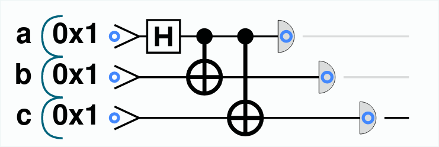

# Task 1

In order to implement a random generator that generates three equal bits we can extend the reading out of a Bell pair to three qubits instead of two: this will work as a Quantum Random Number Generator with agreeing random values on three qubits. 

The circuit of the program I wrote is the following:

{width=250px}

The code is the following:
```js
qc.reset(3);
var a = qint.new(1, 'a');
var b = qint.new(1, 'b');
var c = qint.new(1, 'c');
qc.write(0);
a.had();
b.cnot(a);
c.cnot(a);
var a_result = a.read();
var b_result = b.read();
var c_result = c.read();
qc.print(a_result);
qc.print(b_result);
qc.print(c_result);
```

This code, as I said, extends the Bell pair for shared randomness to three qubits (so, to be fair, it shouldn't be called Bell pair). First of all, it creates three qubits; then it places into superposition the first qubit `a`, and it entangles the second and the third qubits (`b` and `c`) using the `cnot` operation. Finally, it reads the value of the three qubits and it prints the three values. The result is, obviously, a random number that could be either `000` or `111`.

# Task 2

Since QCEngine is based on JavaScript, in order to study the average of the values `READ` gives I used a simple `for` cicle. For the sake of clarity, the code I used is the following:

```js
// Variables
const N_ITER = 100; // Number of iterations
var n_zeros = 0;
var n_ones = 0;
var avg = 0;

for(i=0; i<N_ITER; i++) {
    // Initialization
    qc.reset(3);
    var input1 = qint.new(1, 'input1');
    var input2 = qint.new(1, 'input2');
    var output = qint.new(1, 'output');
    
    // Different states to study (in this case both are |1>)
    input1.write(1);
    input2.write(1);

    // Swap test
    output.write(0);
    output.had();
    input1.exchange(input2, 0x1, output.bits());
    output.had();
    output.not();
    
    // Read result
    var result = output.read();
    
    avg += result;
    if (result === 0) {
        n_zeros += 1;
    } else {
        n_ones += 1;
    }
}

qc.print('Number of zeros: ' + n_zeros);
qc.print('\nNumber of ones: ' + n_ones);
qc.print('\nAverage: ' + avg/N_ITER)
```

**Note:** this is the code for case A, but I changed the input values for the other cases.

## Case A: both states are $|1\rangle$

In order to put both states to $|1\rangle$ the code is the same I reported above, _i.e._:

```js
input1.write(1);
input2.write(1);
```

The **results** I got on this case are, unsurprisingly, the following:
```
Number of zeros: 0
Number of ones: 100
Average: 1
```

This means that, on 100 different runs, all the values were equal.

## Case B: one state $|0\rangle$ and one in Hadamard state

In order to put one state to $|0\rangle$ and the other in Hadamard state, I used the following code:

```js
input1.write(0);
input2.write(0);
input2.had();
```

The **results** I got on this case are the following:
```
Number of zeros: 29
Number of ones: 71
Average: 0.71
```

This means that about the 71% of values were equal on 100 different runs. However, every execution led to a different result, so I tried to "stabilize" the average increasing the number of executions; the results I got with 10000 different runs are the following:
```
Number of zeros: 2431
Number of ones: 7569
Average: 0.7569
```

## Case C: both in Hadamard state with same phase

In order to put both qubits in Hadamard state, I used the following code:

```js
input1.write(0);
input2.write(0);
input1.had();
input2.had();
```

(**Note:** the result would have been the same if the two qubits were put to 1 instead of 0.)

The **results** I got on this case are the following:
```
Number of zeros: 0
Number of ones: 100
Average: 1
```

This means that, on 100 different runs, all the values were equal.

## Case D: both in Hadamard state with $90^{\circ}$ phase difference

In order to put both qubits in Hadamard state with a phase difference, I used the following code:

```js
input1.write(0);
input2.write(0);
input1.had();
input2.had();
input1.phase(90);
```

(**Note:** the result would have been the same if the two qubits were put to 1 instead of 0 and/or the phase shift was applied on the other qubit and/or the phase shift was 270 or -90 instead of 90).

The **results** I got on this case are the following:
```
Number of zeros: 22
Number of ones: 78
Average: 0.78
```

This means that about the 78% of values were equal on 100 different runs. However, every execution led to a different result, so I tried again to "stabilize" the average increasing the number of executions; the results I got with 10000 different runs are the following:
```
Number of zeros: 2443
Number of ones: 7557
Average: 0.7557
```