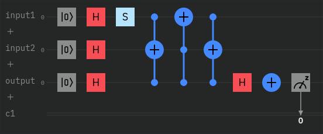
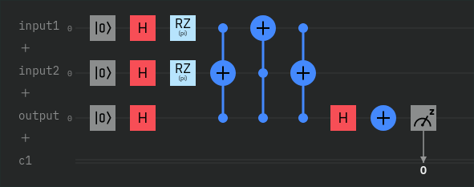
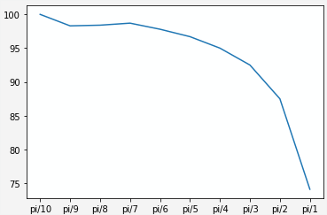

# Task 1

This is the reimplementation of `#3-2 D` with QisKit; the code and the circuit diagram that follow are the ones with the fixed phase equal to $\pi/2$.

```py
from ibm_quantum_widgets import CircuitComposer
from qiskit import QuantumRegister, ClassicalRegister, QuantumCircuit
from qiskit import execute, Aer, IBMQ, BasicAer
from qiskit.compiler import transpile, assemble
from qiskit.tools.jupyter import *
from qiskit.visualization import *
from ibm_quantum_widgets import *
from numpy import pi

# initialize registers and qubits
qreg_input1 = QuantumRegister(1, 'input1')
qreg_input2 = QuantumRegister(1, 'input2')
qreg_output = QuantumRegister(1, 'output')
creg_c = ClassicalRegister(1, 'c')
circuit = QuantumCircuit(qreg_input1, qreg_input2, qreg_output, creg_c)

# input states
circuit.reset(qreg_input1[0])
circuit.reset(qreg_input2[0])
circuit.reset(qreg_output[0])
circuit.h(qreg_input1[0])
circuit.h(qreg_input2[0])
circuit.h(qreg_output[0])
circuit.s(qreg_input1[0])

# swap test
circuit.ccx(qreg_input1[0], qreg_output[0], qreg_input2[0])
circuit.ccx(qreg_output[0], qreg_input2[0], qreg_input1[0])
circuit.ccx(qreg_input1[0], qreg_output[0], qreg_input2[0])
circuit.h(qreg_output[0])
circuit.x(qreg_output[0])

# read result
circuit.measure(qreg_output[0], creg_c[0])

# execute code and get results
simulator = Aer.get_backend('qasm_simulator')
job = execute(circuit, simulator, shots=1000)
result = job.result()
counts = result.get_counts(circuit)

comp = CircuitComposer(circuit=circuit)
print('Counts =', counts)
comp
```

{width=280px}

**Notes:**

- The S gate is exactly the phase gate with relative phase equals to $\pi/2$;
- I used the three `CCNOT`s instead of `CCSWAP` because, apparently, the latter is no longer supported on IBM Quantum Lab.

# Task 2

The gate that allows a phase shift on the $z$ axis, that is what we need if we want to move across the north and the south pole on the Bloch sphere, is the `RZ` gate. I applied this gate to both the input qubits and I got this result with $\phi=\pi$:

{width=400px}

The program's circuit diagram now is as follows:

{width=280px}

In order to plot a graph of the dependency of probability as a function of the angle I slightly modified the code so that I could measure the probability of having two identical values for some small phase shift steps between 0 and $\pi$. The result is the following graph:

{width=280px}

From this graph we can say that the probability tends to $75\%$ when the phase shift tends to $\pi$.