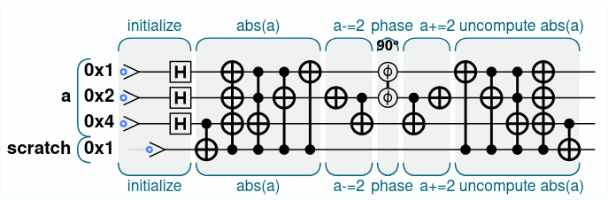
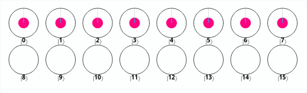

In order to change the phase of those states where `abs(a) < 2` we have to perform some different operations. The code and the circuit diagram that follow are the program itself; after these a brief explanation follows. 

```js
// Initialize
qc_options.color_by_phase = true;
var num_qubits = 3;
qc.reset(num_qubits+1); // three qubits + scratch
var a = qint.new(3, 'a');
var scratch = qint.new(1, 'scratch');

// Starting state
qc.label('initialize');
a.write(0);
scratch.write(0);
a.hadamard(0x1|0x2|0x4);

// abs(a)
qc.label('abs(a)');
qc.cnot(scratch, 0x4);
qc.cnot(a, scratch);
qc.cnot(0x4, ~a|scratch);
qc.cnot(0x2, ~(0x4|scratch));
qc.cnot(0x1, scratch);

// subtract 4 from a
qc.label('a-=4');
a.subtract(4);

// change phase
qc.label('  phase')
qc.phase(90, a.bits(0x1));

// add 4 to a
qc.label('     a+=4')
a.add(4);

// uncompute abs(a)
qc.label('  uncompute abs(a)')
qc.cnot(0x1, scratch);
qc.cnot(0x2, ~(0x4|scratch));
qc.cnot(0x4, ~a|scratch);
qc.cnot(a, scratch);
qc.cnot(scratch, 0x4);
```

{width=350px}

\newpage

What I did is the following:

1. I initialized a multi-qubit register and a **scratch** qubit, necessary to perform the `abs` operation, and I put the three qubit in register `a` in Hadamard state as requested;
2. I computed `abs(a)` using the scratch qubit to save the original sign of `a`;
3. I subtracted 4 from `a` (which is now `abs(a)`). I did this in order to check if `0x1` is equal to 1; in fact, the condition `abs(a)<2` means that `abs(a)={0,1,2,3}`, and then subtracting 4 ensures that `0x1` is equal to 1;
4. I applied the conditional change of phase, that happens when `0x1` is equal to 1 and so when `abs(a)<2`;
5. I added 4 to `a` in order to undo the previous subtraction;
6. I uncomputed `abs(a)` in order to restore the initial state. However, it was not clear to me if I had to uncompute `abs(a)` or not; thus, below are reported the final states for both the options.

The initial states were the following:

{width=370px}

The final states for the code I reported above (with the uncomputing of `abs(a)`) are the following:

{width=370px}

\newpage

The final states without the uncomputing of `abs(a)` are the following:

{width=370px}