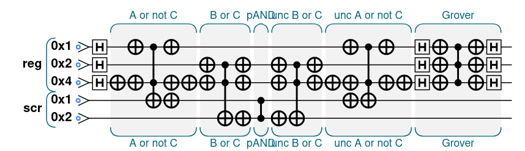
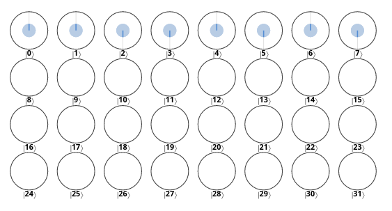
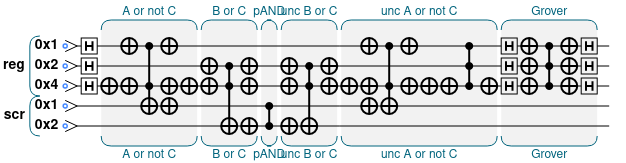
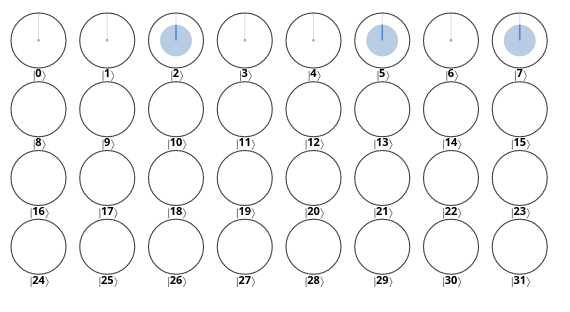

In order to satisfy the given satisfiability problem I followed the general recipe we saw during the last lecture and that is also reported on the textbook. The first step is then to convert the statement into a form having a number of clauses that have to be satisfied simultaneously: $(A\wedge B)\vee (A\wedge C)\vee (B\wedge \neg C)$ then becomes $(A\vee \neg C)\wedge (B\vee C)$, that is the Conjunctive Normal Form. Starting from this I wrote the first code below.

```js
var num_qubits = 3;
var num_ancilla = 2;

// Regulates number of iterations
var n_iter = 5;

/* Step 2-3: initialize the full QPU register in a uniform
 * position and initialize all scratch registers in the
 * |0> state
 */
qc.reset(num_qubits+num_ancilla);
var reg = qint.new(num_qubits, 'reg');
var scr = qint.new(num_ancilla, 'scr');
qc.write(0);
reg.hadamard();

for(var i=0; i<n_iter; i++) {
    
    /* Step 4: build logic gates in each clause one by one
     * storing the output of each logical clause in a
     * scratch qubit
     * A or not C
     */
    qc.label('A or not C');
    qc.not(0x4); // not C
    bit_or(0x1,0x4,0x8); //A or not C  -> 0x8 scratch
    qc.not(0x4); // not C again
        
    // B or C
    qc.label('B or C');
    bit_or(0x2,0x4,0x10); //B or C -> 0x10 scratch

    /* Step 5: phase-logic AND between the scratch qubits
     * to combine the different clauses
     */
    qc.label('pAND');
    phase_and(0x8|0x10);
    
    /* Step 6: uncompute the magnitude-logic operations
     * returning the scratch qubits to their initial states
     */
    // B or C
    qc.label('unc B or C')
    inv_bit_or(0x2,0x4,0x10);

    // A or not C
    qc.label('unc A or not C')
    qc.not(0x4);
    inv_bit_or(0x1, 0x4, 0x8);
    qc.not(0x4);
     
    // Step 7: run a mirror subroutine on the QPU register
    qc.label('Grover');
    reg.Grover();
}

/*
 * Functions
*/

function bit_or(q1, q2, out) {
    qc.not(q1|q2);
    qc.cnot(out,q1|q2);
    qc.not(q1|q2|out);
}

function inv_bit_or(q1, q2, out) {
    qc.not(q1|q2|out);
    qc.cnot(out,q1|q2);
    qc.not(q1|q2);
}

function phase_and(qubits) {
    qc.cz(qubits);
}
```

The circuit is then the following (in this case with only one iteration for readability):

{width=420px}

**Note**: in order to calculate the number of iterations I used the equation reported on the book, _i.e._ $$N_{AA} = \left \lfloor \frac{\pi}{4}\sqrt{2^n} \right \rfloor$$ Since the number of qubits is 3, $N_{AA} = 5$.

The result I got is the following:

{width=350px}

In this image we can see different phases but not different amplitudes: I then modified the code adding a flip routine before the Grover routine; the code is almost the same, with the exception of the flip routine. The circuit is the following:

{width=420px}

The result I got is the following:

{width=350px}

**Note**: since this time I flipped the phase of a qubit, I had to use the updated equation to calculate the number of iterations; this time $N_{AA}=3$.

As one can see from the image, there are three results for which the expression is satisfiable:

- `a=0, b=1, c=0`;
- `a=1, b=0, c=1`;
- `a=1, b=1, c=1`.

This result is partially correct: in fact, these three values are correct but another one is missing, that is `a=1, b=1, c=0` (I manually checked). Unfortunately, I was not able to find out the mistake I made.