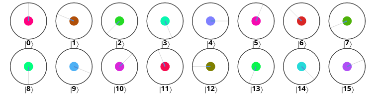

## Introduction

In order to study better the behavior of `invQFT` with input $1100$, I implemented the code in two different ways.

The first way was to simply apply the `invQFT()` subroutine to the given input; in order to do that, I used the following code:

```js
// Initialization
qc.reset(4);
var qin = qint.new(4, 'qin');

qc.label('write');
qin.write(3);

// Inverse QFT
qc.label('invQFT')
qin.invQFT();
```

This code corresponds to the following circuit:

{width=350px}

The result I got using this code is the following:

{width=350px}

Then, I tried to decompose `invQFT`; in order to do that, I wrote the following code:

```js
// Initialization
qc.reset(4);
var qin = qint.new(4, 'qin');

qc.label('write');
qin.write(3);

// Inverse QFT
qc.label('invQFT (decomposed)');

// 1st subroutine
qc.had(0x8);
qc.cphase(90, 0x8|0x4);
qc.cphase(45, 0x8|0x2);
qc.cphase(22.5, 0x8|0x1);

// 2nd subrountine
qc.had(0x4);
qc.cphase(90, 0x4|0x2);
qc.cphase(45, 0x4|0x1);

// 3rd subroutine
qc.had(0x2);
qc.cphase(90, 0x2|0x1);

// 4th subroutine
qc.had(0x1);

// Swaps
qc.swap(0x1|0x8);
qc.swap(0x2|0x4);
```

This code corresponds to the following circuit:

{width=350px}

The result I got using this circuit was exactly the same I got with the first one; this proves that the decomposition of `invQFT` works.

## Explanation

In order to explain what `invQFT` is working with input $1100$, we can analyze the two tasks that the circuit is performing. First of all, the value $\theta$ is found. This value can be simply calculated with the following formula: $$\theta=\frac{n}{2^N}\cdot 360^{\circ}$$ In this case we have that $n=3$ ($1100_2=3_{10}$) and $N=4$ because we have four qubits, thus $$\theta=\frac{3}{16}\cdot 360^{\circ}=67.5^{\circ}$$
Then, the circuit rotates the phase of each circuit by a multiple of the angle $\theta$, where the multiple is the circle's decimal value. We can easily see this from the result reported above.

From another perspective, we can say that `invQFT` consists of four subroutines, which are highlighted by the comments on the code in the introduction section. Each of these subroutines performs the multiple rotations in order of weight with the following rules:

- The first subcircuit rotates the highest weight qubit, _i.e._ `0x8`, by $\frac{3}{8}\cdot 360^{\circ}=67.5^{\circ}$. We can see this in $|1\rangle$;
- The second subcircuit rotates the second highest weight qubit, _i.e._ `0x4`, by $2^1\cdot\frac{3}{8}\cdot 360^{\circ}=135^{\circ}$. We can see this in $|2\rangle$;
- The third subcircuit rotates the third highest weight qubit, _i.e._ `0x2`, by $2^2\cdot\frac{3}{8}\cdot 360^{\circ}=270^{\circ}$. We can see this in $|4\rangle$;
- The fourth subcircuit rotates the fourth highest weight qubit, _i.e._ `0x1`, by $2^3\cdot\frac{3}{8}\cdot 360^{\circ}=540^{\circ}=180^{\circ}$. We can see this in $|8\rangle$.

To go even more into deep of this, we can try to understand what a single subrountine does; let's then analyze the first subcircuit. In this subroutine we have conditional phase shifts on every couple of qubits that involves `0x8`. We then have a total of three conditional phase shifts: in code, this means `qc.cphase(90, 0x8|0x4)`, `qc.cphase(45, 0x8|0x2)` and `qc.cphase(22.5, 0x8|0x1)`. Since the qubit `0x4` is $0$, the phase shift doesn't happen; instead, since `0x1` and `0x2` are equal to $1$, the subrountine is rotating `0x8` by $45^{\circ}+22.5^{\circ}=67.5^{\circ}$.
The same applies to the other three subroutines, but in different ways: the second one is rotating `0x4` by $90^{\circ}+45^{\circ}=135^{\circ}$, the third one is rotating `0x2` by $90^{\circ}$ and the fourth one is just putting `0x1` in hadamard state. This works because at this point we already have the correct answer, but it's in the wrong order; because of this, we then need to apply two swaps on `0x1`, `0x8` and `0x2`, `0x4`.